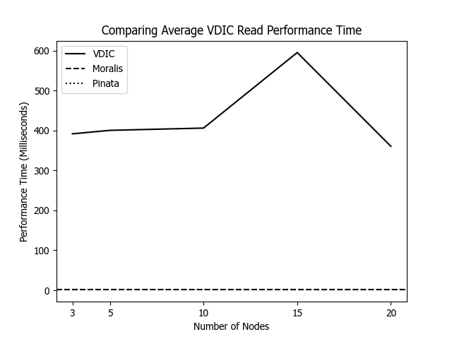
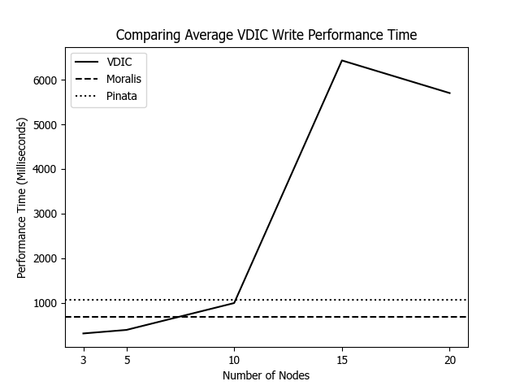

# Evaluation of Verifiable Decentralized IPFS Cluster (VDICs) 

## Content
This repo contains:
1. `evaluation-figures` folder containing figures produced by running entire `evaluation.ipynb`. These figures are then used in the paper introducing VDICs.
2. `ipfs-clusters` folder containing ``docker-compose.yml`` files that must be used to create IFPS Clusters for VDICs of different size regarding number of nodes
3. `pinning-services` folder containing:
    1. logic for using pinning service providers: [Pinata](https://www.pinata.cloud/) and [Moralis](https://moralis.io/how-to-upload-files-to-ipfs-full-guide/)
    2. for each pinning service provider: script for testing reading and writing of data
4. `test-data` folder containing the five text files of different size (1, 10, 100, 1000, 10000 KB) used for testing VDICs
5. `vdic-gateway` containing:
    1. the gateway module of any VDIC inside `index.js`
    2. script for testing reading and writing of data in VDICs
    3. performance measurements
6. `evaluation.ipynb` containing script and 
7. ``requirements.txt``
8. all remaining files can be ignored

DISCLAIMER: The implemented VDICs in this repo only possess the necessariy components and functionalities to test their read and write performance. Therefore, the code is not advised to be used for production.

## Testing VDICs as off-chain storage for DApps
In this repo, we test the...
1. read performance in VDICs depending on file size and number of nodes (vs. pinning services: Pinata and Moralis)
2. write performance in VDICs depending on file size and number of nodes (vs. pinning services: Pinata and Moralis). 
    - Note: We define the write performance equal to latency, which is the time needed for a file to fully replicate in VDICs after its written. This is so because writing data to VDICs is successfull if permanency is guranteed on a technical level which is the case once the newly written file is fully replicated. To achieve this write operation, VDICs bundle the native IPFS Cluster operation of writing files and pinning files together.

NOTE: 
- number of nodes: {3, 5, 10, 15, 20}
- file size (in KB): {1, 10, 100, 1000, 10000}

### Set up test environment
- run ``docker-compose up`` in terminal while being located in subfolder of folder `ipfs-clusters` (do this for each subfolder) 
    - note 1: in case you want to remove all files from an ipfs cluster: delete the compose folder in this repo, delete the docker folder and then re-run docker-compose up
    - note 2: we followed this [guide](https://ipfscluster.io/documentation/quickstart/) for implementing ipfs clusters in docker
- move with terminal to folder `vdic-gateway` and run `npm install`
- move with terminal to folder `pinning-services` and run `npm install`
- in the root folder start a python virtual environment with all packages installed listed in `requirements.txt`

### Perform tests
1. test pinning service providers:
    - open terminal and move to folder `pinning-services`
    - to test moralis pinning service coded in `moralis-pinning-service.js`, run command `node moralis-write-test.js` and then run `node moralis-read-test.js`. These two commands resepctively populates the csv file `moralis-write-performance-measurements.csv` and `moralis-read-performance-measurements.csv`.
    - to test pinata pinning service coded in `pinata-pinning-service.js`, run command `node pinata-write-test.js` and then run `node pinata-read-test.js`. These two commands resepctively populates the csv file `pinata-write-performance-measurements.csv` and `pinata-read-performance-measurements.csv`.

2. test VDICs:
    - start running docker composition that runs IPFS Cluster with desired number of nodes (See folder `ipfs-clusters`)
    - open terminal and move to folder: `vdic-gateway`
    - run gateway by entering in terminal ``npm start``
    - open another terminal and move to `vdic-gateway` folder and run command `node vdic-write-test.js <numberOfNodes>` to test writing data to VDIC
        - note 1: the number of nodes inputted must match the number of nodes of the ipfs cluster you are currently running in docker
        - note 2: re-running this command leads to the deletion of the measurements of the previous run
    - run command `node vdic-read-test.js <numberOfNodes>` to test reading of data in VDIC (do this after having performed write test by running: `node vdic-write-test.js <numberOfNodes>`)
        - note 1: the number of nodes inputted must match the number of nodes of the ipfs cluster you are currently running in docker
        - note 2: re-running this command leads to the deletion of the measurements of the previous run

3. evaluate test results:
    - run entire script inside `evaluation.ipynb`
    - resulting figures are stored in folder `evaluation-figures`
        - note: re-running the entire script inside `evaluation.ipynb` leads to the overwrite of all figures in folder `evaluation-figures`

## Test results and interpretation
The test scripts and Gateway component are implemented in Node.js (version 20.8.1). Docker (version 25.0.3) is used to run IPFS Clusters with varying numbers of nodes. All tests are conducted on a single machine with Windows 11, an AMD Ryzen 7 7735HS processor at 3.20 GHz, and 16 GB of RAM.

### Read performance
Read performance measures the time required to retrieve data from VDICs, which is crucial for DApps needing instant data availability.

Our tests reveal that VDICs, regardless of their number of nodes, generally exhibit slower read performance compared to the pinning services Pinata and Moralis. This slower read performance makes VDICs less favorable for DApps that demand immediate data access. Despite a slight increase in read time for VDICs with 15 nodes due to hardware and internet constraints, the average read performance for VDICs is around 400 milliseconds. The single gateway of VDICs might present a bottleneck, whereas pinning services likely have more access points and an efficient middleware to manage incoming requests. However, since pinning services do not disclose their technology or the number of nodes used for data replication, a proper comparison with VDIC is not possible. This underscores the transparency issues in pinning services.

### Write performance
Write performance measures the time needed for newly added files to replicate across all VDIC nodes.

Our tests show that VDICs with up to 10 nodes achieve write performance comparable to pinning services, with average write operations taking approximately one second or less. The significant increase in write time for VDICs with 15 nodes is attributed to hardware and internet constraints. Generally, writing time increases with the number of nodes in VDICs, suggesting a trade-off between decentralization and write performance in VDICs.

